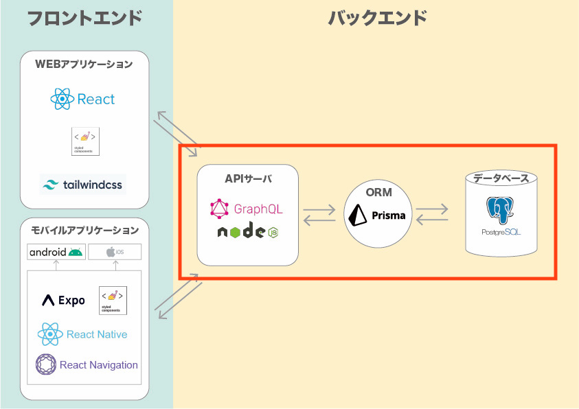

# 코코 API

"코코 API"는 강아지를 위한 SNS 코코의 API입니다.

Read this in other languages: [日本語](./README.md), [English](./README.en.md), [한국어](./README.ko.md)

## 사용 기술

이 프로젝트에서 사용한 주요 기술은 다음과 같습니다.

- Apollo GraphQL yoga: 1.18.3
- Prisma: 1.34.10

## 구성

|  |
| :----------------------------------------------: |

